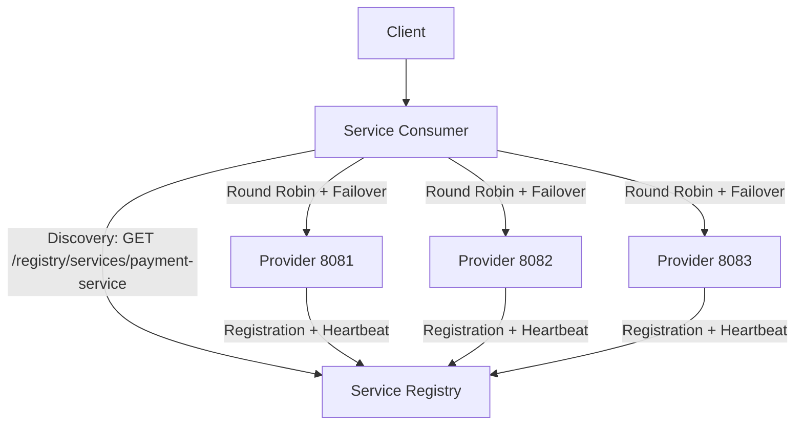
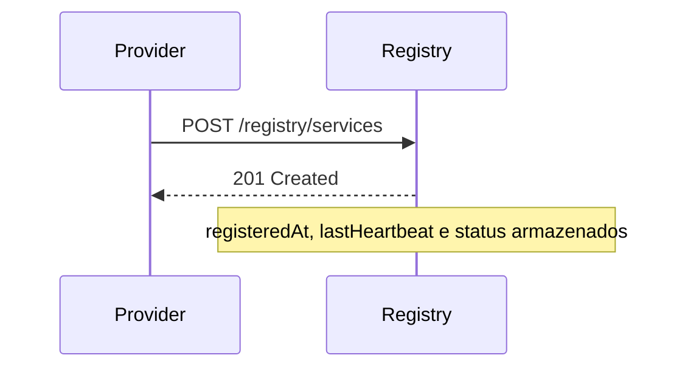
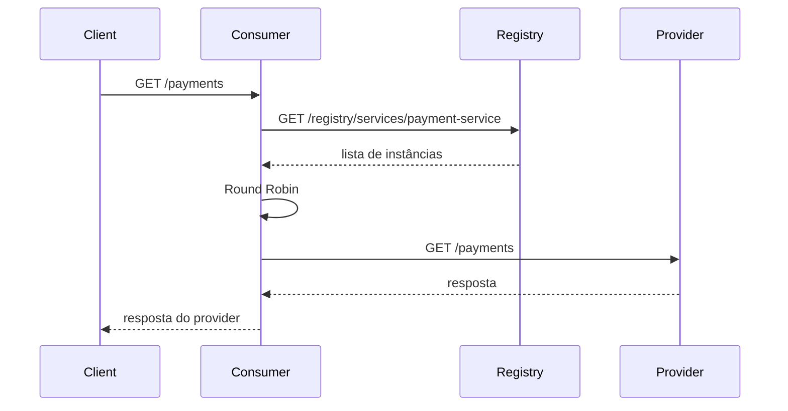
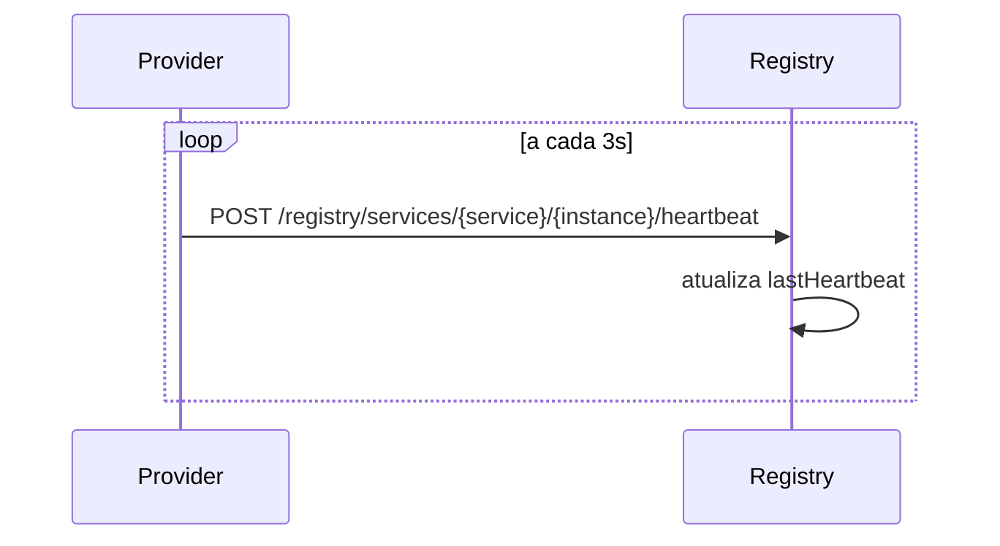
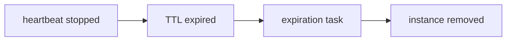
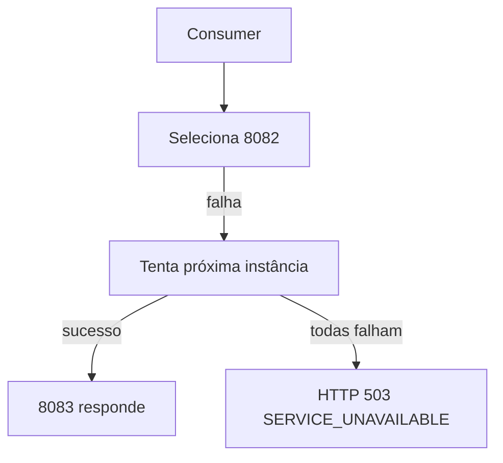

# service-discovery-lab

POC educacional em Java 21 + Spring Boot 3 que implementa **Service Discovery manualmente**, sem Eureka, Consul, Zookeeper, Kubernetes Service Discovery, Spring Cloud LoadBalancer ou qualquer framework que abstraia Registry/Discovery.

## O que o projeto demonstra

Service Discovery resolve o problema de clientes encontrarem instâncias dinâmicas de um serviço sem conhecer portas/endpoints previamente. Nesta V1, tudo é feito em memória e manualmente:

```text
Provider → Registration → Service Registry → Discovery → Consumer → Client-Side Load Balancing
```

* **Service Registry**: catálogo thread-safe em memória com `ConcurrentHashMap`.
* **Service Provider**: `payment-service`; registra-se, envia heartbeat e remove o registro no shutdown normal.
* **Service Consumer**: conhece apenas o nome `payment-service` e a URL do Registry.
* **Registration**: POST do Provider para `/registry/services`.
* **Heartbeat**: sinal periódico para renovar `lastHeartbeat`.
* **TTL / Instance Expiration**: instâncias sem heartbeat acima do TTL são removidas.
* **Discovery**: Consumer consulta `/registry/services/payment-service`.
* **Client-Side Load Balancing**: Consumer escolhe a instância localmente.
* **Round Robin**: seleção manual e thread-safe com contador atômico.
* **Failover**: se uma instância falha, as demais são tentadas uma vez; sem retry infinito.

## Arquitetura geral



## Registro



## Discovery



## Heartbeat



## Expiração por TTL



## Failover



## Módulos

```text
service-discovery-lab/
├── service-registry/
├── service-provider/
├── service-consumer/
├── docker-compose.yml
├── pom.xml
├── README.md
└── .gitignore
```

## Endpoints

### Registry

```text
POST   /registry/services
GET    /registry/services
GET    /registry/services/{serviceName}
POST   /registry/services/{serviceName}/{instanceId}/heartbeat
DELETE /registry/services/{serviceName}/{instanceId}
```

Modelo público:

```json
{
  "serviceName": "payment-service",
  "instanceId": "payment-service-8081",
  "host": "localhost",
  "port": 8081,
  "healthUrl": "http://localhost:8081/actuator/health"
}
```

### Provider

```text
GET /payments
```

Resposta:

```json
{
  "service": "payment-service",
  "instanceId": "payment-service-8081",
  "port": 8081,
  "message": "Response from payment-service instance 8081"
}
```

### Consumer

```text
GET /payments
```

Em indisponibilidade total:

```json
{
  "error": "SERVICE_UNAVAILABLE",
  "message": "No available instances for payment-service"
}
```

## Executando com Docker Compose

```bash
docker compose up --build
```

Verifique o Registry:

```bash
curl http://localhost:8761/registry/services
```

Faça chamadas e observe o Round Robin:

```bash
curl http://localhost:8080/payments
curl http://localhost:8080/payments
curl http://localhost:8080/payments
```

Exemplo esperado:

```text
Request 1 → 8081
Request 2 → 8082
Request 3 → 8083
Request 4 → 8081
```

Derrube uma instância:

```bash
docker compose stop payment-service-2
```

Aguarde o TTL (`10s`) e veja nos logs:

```text
heartbeat stopped
        ↓
TTL expired
        ↓
instance removed
```

Novas chamadas devem continuar em `8081` e `8083`, sem enviar tráfego para a instância expirada.

## Executando localmente

Em terminais separados:

```bash
mvn -pl service-registry spring-boot:run
mvn -pl service-provider spring-boot:run -Dspring-boot.run.arguments="--server.port=8081 --service.discovery.port=8081"
mvn -pl service-provider spring-boot:run -Dspring-boot.run.arguments="--server.port=8082 --service.discovery.port=8082 --service.discovery.instance-id=payment-service-8082"
mvn -pl service-provider spring-boot:run -Dspring-boot.run.arguments="--server.port=8083 --service.discovery.port=8083 --service.discovery.instance-id=payment-service-8083"
mvn -pl service-consumer spring-boot:run
```

## Health checks

Todos os módulos expõem:

```text
/actuator/health
/actuator/info
/actuator/metrics
```

## Logs didáticos

```text
[REGISTRY] Service registered: payment-service-8081
[REGISTRY] Heartbeat received: payment-service-8081
[REGISTRY] Service expired: payment-service-8082
[CONSUMER] Discovered instances: [8081, 8082, 8083]
[CONSUMER] Selected instance: payment-service-8081
[CONSUMER] Instance payment-service-8082 unavailable
[PROVIDER] Processing request on instance: payment-service-8081
```

## Testes

```bash
mvn test
mvn clean verify
```

## Evoluções futuras

Somente a V1 manual foi implementada. Possíveis próximas versões:

```text
V1
Service Discovery manual
        ↓
Entendimento do padrão

V2
Eureka
        ↓
Framework abstraindo o padrão

V3
Consul
        ↓
Service Discovery dedicado

V4
Kubernetes
        ↓
Service Discovery baseado em infraestrutura
```

Outras evoluções possíveis: Circuit Breaker, Retry, API Gateway, OpenTelemetry, Prometheus, Grafana, Service Mesh e Istio.
